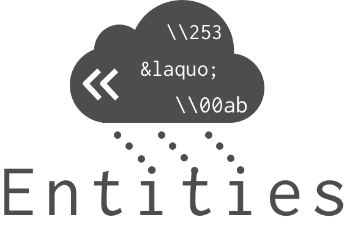
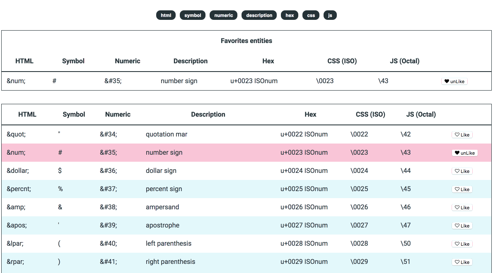

# Cloud Entities app

## :speech_balloon: What...

Cloud Entities is a collection of 234 special characters encoded in 6 different languages (plain symbol, html, css, numeric, hex and octal).

Easy to use, you can copy what you need just one click.
You can also find in the code source a javascript list of literal object of all these characters.

*Check my [cloud entities app](https://istuffs.github.io/cloud-entities/)*

## 🤔 Why !?

Do you know witch hexadecimal value you need to encode a slash *(/)*? `\57` 
Do you Know how to encode the angled quotation mark for you before/after ::speudo-element in css *(«)*? `\00ab` 
Do you know the HTML entitie for a pilcrow *(¶)*? `&para;`
> If you do, watch out! You may be a cyborg and you don't know yet. *Checkout for serial number tattoo*.

Personally, I don't. I can't remember them all. So I've create an handy way to retrieve them quickly. 
**Here they are, all stored in my [cloud entities app](https://istuffs.github.io/cloud-entities/) ready too be copy pasted in a blaze** :fire:.

## Features 🤘

-   **Favorites** special characters saved in you browser local storage, to keep them right under the palm of your hand.

-   **Auto copy**, just one click and you're done.

-   **Filters**, keep only the informations you need.

-   **234 Entities** listed an **encoded in 6 different context**.

--- -----

Coded with :heart: by [iStuffs](https://github.com/iStuffs)
